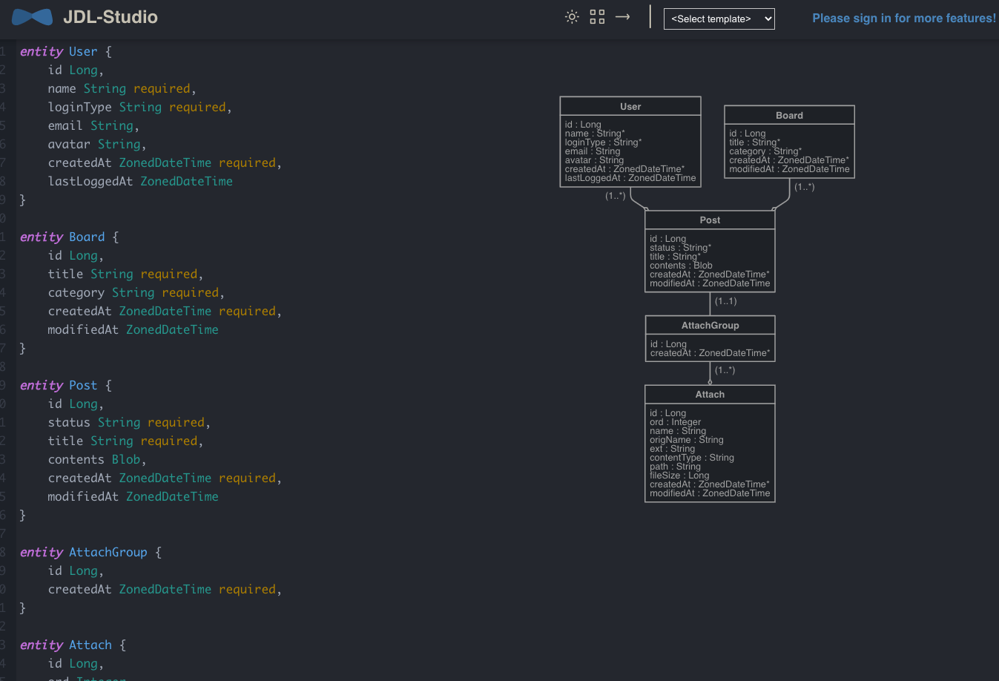
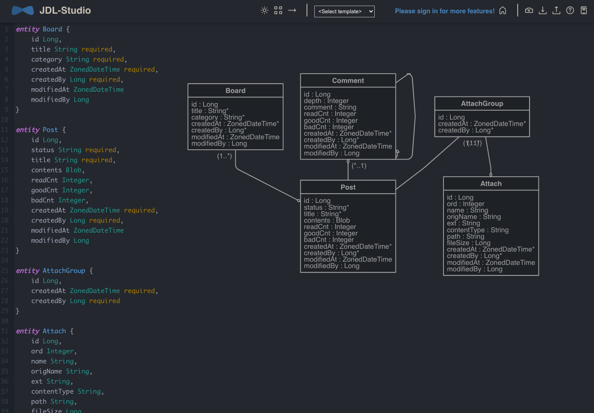
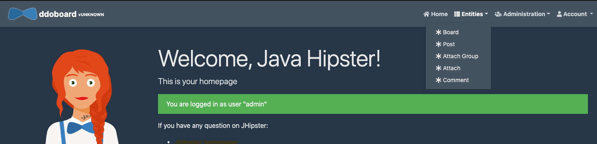

# 데이터 모델링 

이제 우리가 작성할 게시판의 데이터 모델링을 수행해 보자. 

jHipster 는 데이터 모델링괴 JPA 코드 자동 생성을 지원하고 있으며, 이를 위한 간단한 언어인 JDL(JHipster Domain Langualge) 를 제공하고 있다. 

## JDL Studio 

[JDL Studio](https://start.jhipster.tech/jdl-studio/) 는 도메인 모델을 정의하고, 이를 ERD로 표현해주는 강력한 UI 모델링 툴이다. 

쉬우면서도, 간편하게 DB Model, JPA Entity, Repository, Service 그리고 심지어 프런트엔드 화면까지 템플릿으로 제공해 준다. 

[JDL](https://www.jhipster.tech/jdl/) 에서 자세한 사용법을 익힐 수 있다. 

JDL 화면은 다음과 같다. 



## Board Modeling 

이제는 게시판을 모델링 해보자. 

게시판을 구성하는 엔터티들을 한번 나열해 보자. 

- Board: 게시시물을 그룹화 할 수 있는 게시판 정보 
- Post: 게시물 정보
- AttachGroup: 게시물에 저장될 파일 그룹 
- Attach: 게시판내 파일
- Comment: 게시물 커멘트 정보 

## JDL 스크립트 작성 

이제 JDL 스크립트를 생성해 보자. 

### Board 구조 생성 

```go
entity Board {
    id Long,
    title String required,
    category String required,
    createdAt ZonedDateTime required,
    createdBy Long required,
    modifiedAt ZonedDateTime
    modifiedBy Long
}
```

- id: 게시판 아이디
- title: 게시판 이름 
- category: 게시판 카테고리 코드 
- createdAt: 생성일시 
- createdBy: 생성자
- modifiedAt: 수정일시
- modifiedBy: 수정자 

### Post 구조 생성 

```go
entity Post {
    id Long,
    status String required,
    title String required,
    contents Blob,
    readCnt Integer,
    goodCnt Integer,
    badCnt Integer,
    createdAt ZonedDateTime required,
    createdBy Long required,
    modifiedAt ZonedDateTime
    modifiedBy Long
}
```

- id: 게시물 아이디
- status: 게시물의 상태 (작성중, 오픈, 클로즈)
- title: 게시물 제목 
- contents: 게시물 내용 
- readCnt: 조회수
- goodCng: 좋아요 횟수
- badCnt: 싫어요 횟수
- createdAt: 생성일시
- createdBy: 생성자
- modifiedAt: 수정일시
- modifiedBy: 수정자 

### AttachGroup

```go
entity AttachGroup {
    id Long,
    createdAt ZonedDateTime required,
    createdBy Long required
}
```

- id: 게시물 첨부파일 그룹 아이디 
- createdAt: 생성일시
- createdBy: 생성자

### Attach

```go
entity Attach {
    id Long,
    ord Integer,
    name String,
    origName String,
    ext String,
    contentType String,
    path String,
    fileSize Long,
    createdAt ZonedDateTime required,
    createdBy Long required,
    modifiedAt ZonedDateTime
    modifiedBy Long
}
```

- id: 게시물 첨부파일 아이디 
- ord: 첨부파일 정렬 순서 
- name: 첨부파일 이름 
- origName: 첨부파일 원본 파일 이름 
- ext: 확장자 
- contentType: 컨텐츠 타입 
- path: 컨텐츠 파일 저장 경로 
- fileSize: 컨텐츠 파일 크기
- createdAt: 생성일시
- createdBy: 생성자
- modifiedAt: 수정일시
- modifiedBy: 수정자 

### Comment 

```go
entity Comment {
	  id Long,
    depth Integer,
    comment String,
    readCnt Integer,
    goodCnt Integer,
    badCnt Integer,
    createdAt ZonedDateTime required,
    createdBy Long required,
    modifiedAt ZonedDateTime
    modifiedBy Long
}
```

- id: 커멘트 아이디 
- depth: 커멘트 뎁스
- comment: 커멘트 내용
- readCnt: 조회수
- goodCng: 좋아요 횟수
- badCnt: 싫어요 횟수
- createdAt: 생성일시
- createdBy: 생성자
- modifiedAt: 수정일시
- modifiedBy: 수정자 

### 연관관계 매핑 

게시판의 경우에는 명확히 연관 매핑이 필요하다. 

그러므로 매핑을 수행해 볼 것이다. 

#### OneToMany 매핑 

```go
relationship OneToMany {
    Board{post} to Post,
    AttachGroup{attach} to Attach,
    Comment{comment} to Comment{parent},
}
```

연관 매핑을 위해서는 relationship 을 이용한다. 

- OneToMany: 1:N 관계를 적용한다. 
- Board{post} to Post: 이 의미는 Board 는 1에 해당하고, Post는 N에 해당된다. 그리고 Board에서는 post라는 변수로 N개의 Post를 가진다는 의미이다. 
- AttachGroup{attach} to Attach: AttachGroup은 복수개의 Attach를 가진다. 
- Comment{comment} to Comment{parent}: 이 의미는 1:N과계이며, Self Reference를 생성할 수 있도록 해준다. (즉, 답글에 답글을 달 수 있기 때문이다.)

**중요 포인트는 연관을 맺을 때 앞에 나오는 엔터티는 연관관계를 소유하고 있는 쪽이다. 

#### ManyToOne 매핑 

```go
relationship ManyToOne {
    Comment{post} to Post
}
```

이 내용은 Post하나에 대해서 복수개의 Comment를 가진다. 

#### OneToOne 매핑 

```go
relationship OneToOne {
  	AttachGroup{post} to Post
}
```

1:1 연관을 매핑한다. 

뒤 내용은 AttachGroup 가 Post에 대한 레퍼런스를 가진다. 즉, Post가 있어야, AttachGroup를 만들 수 있다는 것을 구현할 수 있게 된다. 

#### 매핑 설정하기. 

```go
dto * with mapstruct
```

mapstruct 를 통해서 Entity와 DTO 매핑을 수행하겠다는 의미이다. 

#### 서비스 생성하기. 

서비스를 생성할때 ServiceImpl 을 이용하여 구현하도록 한다. 

```go
service all with serviceImpl
```

#### 페이징 설정하기. 

페이징은 2가지를 제공한다. 

- 일반적인 페이징 (우리 예제는 일반적인 페이징 예시이다.)
- 무한 스크롤 페이징 

```go
paginate Board, Post, AttachGroup, Attach, Comment with pagination
```

Board, Post, AttachGroup, Attach, Comment 엔터티는 페이징을 지원함을 의미한다. 

#### 무한 스크롤 

무한 스크롤은 페이징과 동일하며, "infinite-scroll" 을 통해서 가능하다. 

### JDL Studio 생성 내역 



최종적으로 위 그림과 같이 엔터티가 생성됨을 확인할 수 있다. 

해당 내역을 복사하거나, Ctrl + C 등을 클릭하면 정의 파일을 다운로드 할 수 있다. 

### JDL 구현체 생성하기. 

이제 JHipster을 통해서 JDL 구현체를 생성해 보자. 

```go
jhipster import-jdl <*.jh 파일 경로>
```

위와 같이 수행하면 다음과 같은 형태의 파일이 생성된다. 

- Entity: JDL로 정의한 엔터티이며, src/main/java/<package>/domain/***.java 로 파일이 생성된다. 
- DTO: src/main/java/<package>/service/dto/***DTO.java 
- Repository: src/main/java/<package>/repository/***Repository.java
- Service: src/main/java/<package>/service/***Service.java
- MapStructMapper: src/main/java/<package>/service/mapper/***.java
- Resource(Controller): src/main/java/<package>/web.rest/***Controller.java
- frontend: src/main/webapp/app/entities 하위에 프런트엔드 소스들이 생성될 것이다. 

## 화면 보기 

생성이 완료되면 다음과 같은 엔터티에 데이터를 적용 및 조회할 수 있는 화면이 생성된다. 




